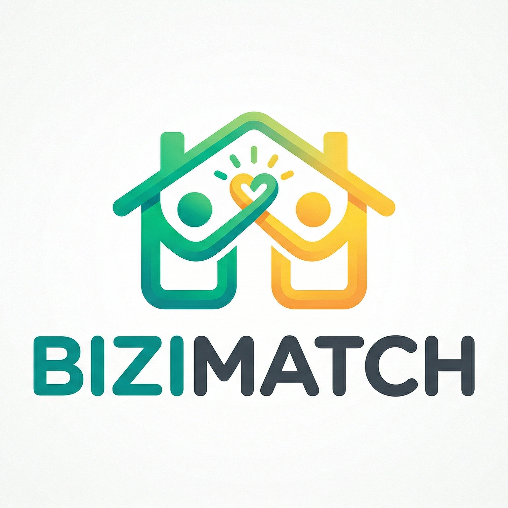
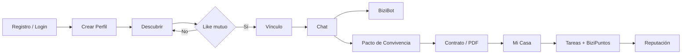

# BiziMatch

> La app para encontrar compañeros de piso compatibles, cerrar vínculos con confianza y gestionar la convivencia después del match.

<p align="center">
  
</p>

<p align="center">
  <a href="https://flutter.dev"></a>
  <a href="https://dart.dev"></a>
  <a href="https://firebase.google.com"></a>
  
</p>

---

## Visión

**BiziMatch** nace para resolver un problema muy real: compartir piso no debería depender solo de una foto, una ubicación y algo de suerte.

La aplicación combina descubrimiento tipo swipe, compatibilidad por hábitos, chat en tiempo real, herramientas de seguridad y módulos de convivencia para acompañar al usuario desde la búsqueda inicial hasta la gestión diaria de la casa compartida.

No es solo una app para encontrar piso. Es un ecosistema de convivencia.

---

## Índice

- [Qué Hace BiziMatch](#qué-hace-bizimatch)
- [Funcionalidades Principales](#funcionalidades-principales)
- [Experiencia de Usuario](#experiencia-de-usuario)
- [Modo Demo para Presentación](#modo-demo-para-presentación)
- [Arquitectura del Proyecto](#arquitectura-del-proyecto)
- [Stack Técnico](#stack-técnico)
- [Instalación](#instalación)
- [Estructura de Carpetas](#estructura-de-carpetas)
- [Calidad y Verificación](#calidad-y-verificación)
- [Contexto Académico](#contexto-académico)

---

## Qué Hace BiziMatch

BiziMatch conecta personas compatibles para compartir vivienda usando criterios de convivencia reales:

- Horarios.
- Limpieza.
- Mascotas.
- Fumadores.
- Teletrabajo.
- Frecuencia de fiestas.
- Presupuesto.
- Afinidad general.

Una vez aparece un vínculo, la app no se detiene en el match: permite hablar, revisar acuerdos, generar documentos, repartir tareas, sumar BiziPuntos y mejorar la confianza entre usuarios mediante reputación.

---

## Funcionalidades Principales

### Descubrir Perfiles

- Interfaz de swipe fluida para explorar usuarios.
- Tarjetas con imagen, edad, origen, precio y porcentaje de afinidad.
- Filtros por edad, género, hábitos y estilo de convivencia.
- Animaciones de arrastre con rotación, escala, feedback visual y respuesta háptica.
- Hero animations entre fotos de perfil y detalle.

### Algoritmo de Afinidad

El sistema calcula una compatibilidad aproximada entre usuarios cruzando variables de convivencia. El resultado se muestra como un porcentaje claro para que el usuario entienda rápidamente si una persona encaja con su estilo de vida.

### Vínculos y Chat

- Sistema de match por interés mutuo.
- Lista de conversaciones activas.
- Chat en tiempo real con Firestore.
- Notificaciones locales/push preparadas para mensajes.
- Control de teclado con `resizeToAvoidBottomInset` para que el input no quede tapado.

### BiziBot

BiziBot es el asistente de conversación integrado.

- Genera sugerencias para romper el hielo.
- Ayuda a iniciar conversaciones con más naturalidad.
- Se presenta con una UI diferenciada: glassmorphism, glow y borde animado con gradiente para comunicar inteligencia artificial.

### Perfil Personal

- Datos personales y preferencias de convivencia.
- Foto de perfil editable.
- Biografía.
- Nota de voz.
- Indicadores de BiziPuntos, niveles y progreso.
- Reputación basada en reseñas y medallas.

### Sistema de Reputación

- Reseñas entre usuarios con match previo.
- Medallas por convivencia: limpieza, respeto, cocina, silencio.
- Karma visible para reforzar confianza.
- Gamificación del perfil mediante BiziPuntos.

### Mi Casa

Una vez formalizada la convivencia, BiziMatch incorpora un módulo de gestión del hogar:

- Panel de casa compartida.
- Ranking de compañeros.
- Tareas asignadas.
- Recompensas por completar tareas.
- BiziPuntos mensuales.
- Vista demo de casa para la presentación.

### Pacto de Convivencia

- Checklist colaborativo de normas.
- Firma de acuerdos.
- Flujo conectado con el chat.
- Base para formalizar la convivencia antes de mudarse.

### Contratos y PDF

- Previsualización de contrato.
- Generación y gestión de documentos PDF.
- Compartir o imprimir contrato desde la app.
- Vinculación del documento a la casa/chat correspondiente.

### Calculadora de Gastos

- Reparto de alquiler y suministros.
- Generación de desglose.
- Envío del resumen al chat.

### Comunidad

- Planes comunitarios.
- Chats de planes.
- Interacción social más allá del match individual.

### Escuadrones

- Formación de grupos para buscar vivienda en conjunto.
- Exploración de viviendas compartidas por escuadrón.
- Likes coordinados entre miembros.

### Mapa

- Visualización geográfica de viviendas y zonas.
- Integración con `flutter_map` y `latlong2`.
- Enfoque práctico para entender ubicación y contexto.

---

## Experiencia de Usuario

La interfaz se ha pulido para una presentación moderna y memorable:

- **Glassmorphism:** tarjetas semitransparentes con blur mediante `BackdropFilter`.
- **Glow visual:** sombras vibrantes en botones, tarjetas y elementos destacados.
- **Gradientes dinámicos:** esmeralda corporativo combinado con turquesa, índigo y violeta.
- **Microinteracciones:** animaciones suaves en listas y elementos interactivos.
- **Skeleton loaders:** shimmer durante cargas reales o simuladas.
- **Feedback háptico:** respuesta táctil en likes, matches y tareas completadas.
- **Hero animations:** transición visual entre tarjetas y perfil.
- **Tipografía Outfit:** jerarquía más moderna y limpia.
- **Bordes orgánicos:** radios amplios para una estética más amable.

Componentes visuales reutilizables:

- `GlassCard`
- `GlowIconButton`
- `ShimmerSkeleton`
- `AnimatedOrganicBackground`
- `AnimatedRainbowBorder`

Estos componentes viven en:

```text
lib/widgets/glassmorphism.dart
```

---

## Modo Demo para Presentación

BiziMatch incluye un modo especialmente pensado para defensa ante tribunal o demos sin depender completamente de red.

### Cuenta Demo Admin Offline

Puedes entrar sin internet desde la pantalla de login con el botón **Entrar en Demo Admin** o usando estas credenciales locales:

```text
Email: admin@bizimatch.demo
Password: demo2026
```

Esta cuenta no llama a Firebase Auth. Activa el Modo Demo, selecciona el perfil demo principal y guarda una sesión local para que el splash pueda entrar directamente en siguientes aperturas.

### Incluye

- Perfiles locales con imágenes demo.
- Chats demo.
- Casa demo.
- Swipe funcional sin Firebase.
- Match forzado para mostrar el flujo completo.
- Cargas fake profesionales de 500 ms en secciones clave.
- Wakelock activo para que la pantalla no se apague durante la presentación.

### Reset Demo

Desde **Ajustes > Configuración de Presentación**:

- Reinicia el mazo de swipe.
- Limpia los chats locales generados.
- Pone los BiziPuntos a cero.
- Muestra confirmación con SnackBar.

Esto permite repetir la demo delante del tribunal sin tener que reinstalar la app ni tocar la base de datos manualmente.

---

## Arquitectura del Proyecto

El proyecto sigue una organización sencilla y práctica, separando pantallas, modelos, servicios y widgets reutilizables.

```text
lib/
  models/       Modelos de dominio y serialización
  screens/      Pantallas principales de la aplicación
  services/     Firebase, lógica de negocio, APIs y utilidades
  widgets/      Componentes visuales reutilizables
  app_theme.dart
  main.dart
```

### Capas

| Capa | Responsabilidad |
| --- | --- |
| `models` | Representar usuarios, casas, tareas, pactos, planes y viviendas |
| `services` | Aislar Firebase, auth, notificaciones, PDF, comunidad, casa y demo |
| `screens` | Construir flujos visuales y navegación |
| `widgets` | Centralizar UI reutilizable |
| `app_theme.dart` | Sistema de diseño global |

---

## Stack Técnico

### Frontend

- Flutter
- Dart
- Material 3
- Google Fonts
- Animaciones con `animate_do`
- Glassmorphism con `BackdropFilter`
- Shimmer personalizado

### Backend y Datos

- Firebase Core
- Firebase Auth
- Cloud Firestore
- Firebase Messaging
- Firebase Storage
- Notificaciones locales

### Multimedia y UX

- `image_picker`
- `cached_network_image`
- `record`
- `audioplayers`
- `permission_handler`
- `wakelock_plus`

### Mapas y Documentos

- `flutter_map`
- `latlong2`
- `pdf`
- `printing`
- `path_provider`

---

## Instalación

### 1. Clonar el proyecto

```bash
git clone <url-del-repositorio>
cd bizimatch_flutter
```

### 2. Instalar dependencias

```bash
flutter pub get
```

### 3. Configurar Firebase

El proyecto usa Firebase, así que necesitas tener configurados los archivos nativos correspondientes:

- `android/app/google-services.json`
- Configuración iOS/macOS si se compila para esas plataformas.
- Reglas de Firestore adaptadas al entorno de pruebas.

Si partes de cero:

```bash
dart pub global activate flutterfire_cli
flutterfire configure
```

### 4. Ejecutar

```bash
flutter run
```

### 5. Ejecutar tests

```bash
flutter test
```

### 6. Analizar código

```bash
flutter analyze
```

---

## Estructura de Carpetas

```text
assets/
  images/
    logo.png
    demo_people/

lib/
  models/
    casa_model.dart
    community_plan_model.dart
    escuadron_model.dart
    housing_model.dart
    pact_model.dart
    tarea_model.dart
    user_model.dart
    user_profile.dart

  screens/
    discover_screen.dart
    matches_screen.dart
    chat_detail_screen.dart
    profile_screen.dart
    home_management_screen.dart
    community_screen.dart
    map_screen.dart
    settings_screen.dart
    ...

  services/
    auth_service.dart
    firestore_service.dart
    demo_service.dart
    home_service.dart
    notification_service.dart
    pdf_service.dart
    ...

  widgets/
    app_cached_network_image.dart
    glassmorphism.dart
```

---

## Flujo Principal de Usuario



---

## Calidad y Verificación

Comandos recomendados antes de presentar o entregar:

```bash
flutter pub get
dart format lib test
flutter analyze
flutter test
```

Estado actual verificado:

- Tests unitarios pasando.
- App preparada para demo.
- Modo presentación con reset.
- UI modernizada con glassmorphism, glow y animaciones.

---

## Contexto Académico

BiziMatch ha sido desarrollado como proyecto final con el objetivo de demostrar competencias en:

- Desarrollo multiplataforma con Flutter.
- Diseño UI/UX moderno.
- Integración con Firebase.
- Modelado de datos en tiempo real.
- Experiencia de usuario mobile.
- Gamificación.
- Generación de documentos.
- Arquitectura modular.
- Preparación de una demo robusta para presentación final.

---

## Autoría

Proyecto desarrollado como parte del Trabajo de Fin de Grado.

**BiziMatch** representa una visión más humana de la búsqueda de vivienda: menos azar, más compatibilidad y mejores convivencias.
